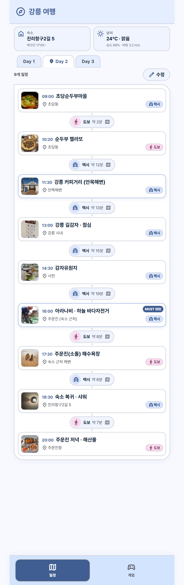
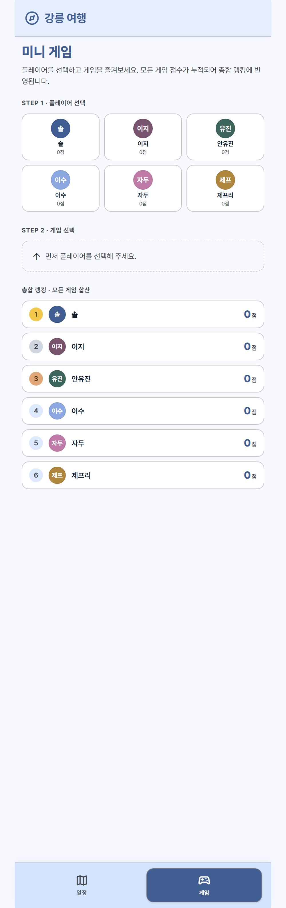

# 강릉 여행 앱 🌊☕

> 강릉 2박 3일 **여행 일정 + 미니게임**을 담은 모바일 웹앱 · Y2K 감성(Ethereal Y2K) UI

<p align="center">
  
  &nbsp;&nbsp;&nbsp;
  
</p>

<p align="center"><sub>왼쪽: 일정(편집 가능) · 오른쪽: 미니게임 & 총합 랭킹</sub></p>

---

## ✨ 주요 기능

### 🗺 여행 일정
- 3일치 코스를 **타임라인 카드**로 표시 (시간 · 장소 · 이동수단 · 소요시간)
- 일정 사이의 **이동 커넥터**(도보/택시 · 약 N분)를 탭하면 **카카오맵 길찾기**로 연결
- **✏️ 수정 버튼**으로 일정을 직접 편집: 제목 · 시간 · 장소 · 이동수단 · 소요시간 · 태그 · 강조,
  그리고 **일정 추가 / 삭제 / 순서 이동** — 저장하면 서버에 **영구 보존**

### 🎮 미니게임 (게임 탭)
- 7종: **돌깨기 · 수박게임 · 2048 · 워들 · 블랙잭 · 오목 · 바둑(9×9)**
- **바둑**: MCTS(몬테카를로 트리 탐색) AI · 난이도 3단계 · 한국식 계가(집 + 사석)
- **오목**: 규칙 기반 AI · 난이도 3단계
- 플레이어 6명, 모든 게임 점수가 **누적**되어 **총합 랭킹**에 반영
- **블랙잭**은 보유 점수로 베팅 (승리 시 배당)

---

## 🛠 기술 스택

| 구분 | 스택 |
|------|------|
| 프론트엔드 | React + Vite + TypeScript (`frontend/`) |
| 백엔드 | Node.js + Express (`backend/`) |
| 배포 | Docker Compose (Nginx 정적 서빙 + `/api` 프록시) |
| 데이터 | JSON 파일 + **Docker 볼륨**(점수·편집 일정 영구 저장) |

---

## 🚀 실행 방법

### 🐳 Docker (추천)

```bash
docker compose up --build
```

- 브라우저에서 **http://localhost:8080** 접속
- 종료: `Ctrl + C` 후 `docker compose down`
- 백그라운드 실행: `docker compose up --build -d`

| 서비스 | 포트 | 설명 |
|--------|------|------|
| `frontend` | `8080:80` | Nginx (React 빌드 서빙 + `/api` → backend 프록시) |
| `backend` | `4000:4000` | Express API |

> 프론트의 Nginx가 `/api` 요청을 내부 네트워크의 `backend:4000`으로 넘겨주므로,
> 브라우저는 **8080 포트 하나만** 사용합니다.

### 💻 로컬 개발 (도커 없이)

```bash
# 터미널 1 — 백엔드 (4000)
cd backend && npm install && npm start

# 터미널 2 — 프론트엔드 (5173)
cd frontend && npm install && npm run dev
```

브라우저에서 **http://localhost:5173** 접속 (Vite 개발 서버가 `/api`를 4000으로 프록시).

---

## 💾 데이터 저장 & 초기화

점수와 편집한 일정은 백엔드 컨테이너의 `/app/data`에 저장되고, 명명된 볼륨 `gangneung-scores`에
보존되어 **`docker compose up --build`로 재빌드해도 유지**됩니다.

- **점수까지 완전 초기화**: `docker compose down -v` (`-v`가 볼륨 삭제) 후 다시 `up`
- **일정만 기본값 복원**: `POST /api/itinerary/reset`
- **컨테이너만 정리(데이터 보존)**: `docker compose down`

---

## 📁 프로젝트 구조

```
Gangneung/
├── docker-compose.yml       # 프론트+백엔드 통합 실행 (+ 점수 볼륨)
├── docs/screenshots/        # README 스크린샷
├── frontend/                # React + Vite + TS
│   └── src/
│       ├── pages/           # Day1~3, 게임 화면들(바둑·오목·블랙잭 등)
│       ├── components/      # 일정 카드/편집기, 이동 커넥터, 하단 탭 등
│       └── lib/             # api, 바둑 엔진(go.ts), 컨텍스트
└── backend/                 # Express API
    └── src/
        ├── data/            # 기본 일정·플레이어 데이터
        ├── store/           # 점수·일정 저장소(볼륨 파일)
        ├── controllers/ · routes/
```

---

## 🔗 API 요약

| 메서드 | 경로 | 설명 |
|--------|------|------|
| GET | `/api/itinerary` | 여행정보 + 전체 일정 |
| PUT | `/api/itinerary` | 일정 수정/저장 |
| POST | `/api/itinerary/reset` | 일정 기본값 복원 |
| GET | `/api/players` · `/api/games` · `/api/ranking` | 플레이어 · 게임 목록 · 총합 랭킹 |
| POST | `/api/scores` | 게임 점수 누적 |
